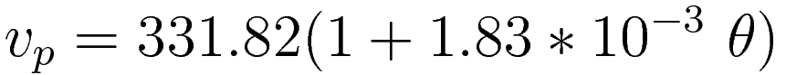
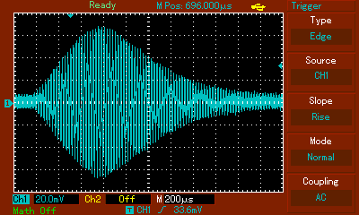
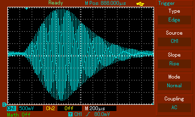

# Ultrasonic Anemometer

  
This is Ultrasonic Anemometer project based on AVR ATmega microcontroller.

## Principle of operation

Device measures wind velocity using ultrasounds. Two ultrasonic transducers installed on the end of both pipes send 40 kHz ultrasound signal between each other. Normally the velocity of this signal is the same for both directions. It is equal to the speed of sound, which depends mainly on the air temperature. For dry air and 1000 hPa pressure it can be calculated from:

where:
* vₚ - speed of sound [m/s]
* θ - air temperature [°C]

At 20 °C it is 343,96 m/s.

If there is a wind, it alters velocity of sound wave propagating in direction parallel to the wind:

where:
* v₁₂ - velocity of sound wave between point 1 and point 2
* v₂₁ - velocity of sound wave between point 2 and point 1
* vₚ - speed of sound
* vᵥᵥ - speed of wind

Above equations can be transformed into:

The velocity of sound wave can be acquired by measuring time of flight of this wave between ultrasonic transducers. This is what this device does. First transducer emits ultrasonic impulse and second one receives it. Time between those events is measured and later the situation is reversed. Second transducers emits and first one receives.  
Knowing distance between those transducers, velocity of sound can be finally calculated.

where:
* d - distance between transducers
* t - time of flight

Velocities in previous equations can be substituted by above time formula:

  
Anemometer has only two ultrasonic transducers. Therefore, it can only measure wind speed in one direction (parallel to line containing both transducers). Measurement in more dimensions can be achievied by adding more transducers.

Device displays calculated wind speed and its direction on [HD44780 LCD](https://en.wikipedia.org/wiki/Hitachi_HD44780_LCD_controller) display. Under speed value there is a progress bar to next measured value. Unfortunately it takes quite a lot of time to perform all the signal processing calculations on this ATmega (about 46 seconds).  
Red LED is lit while power is supplied to the device. Green LED is blinking while the device is working correctly.  
Red button on the right performs calibration procedure. After pressing button for 2 seconds next set of samples acquired by transducers will be stored in EEPROM and used later for signal processing. This has to be done while there is no wind. Along with samples, temperature from DS1820 sensor is also acquired and stored. This calibration data will survive shutdown of the device because of storage in EEPROM.  
On the left side of the device there is a socket for power supply.

 

## Hardware

 

Main part of the device is the AVR [ATmega1284](http://www.atmel.com/devices/atmega1284.aspx) microcontroller. It is slightly overclocked for a better performance. I used 24 MHz quartz crystal (official max. frequency is 20 MHz). Controller is programmed with ISP interface. I used simple and cheap [USBasp](http://www.fischl.de/usbasp/) programmer for it.  
Calibration button was connected together with resistor, capacitor and diode which do hardware [debouncing](https://en.wikipedia.org/wiki/Switch#Contact_bounce).  
All of the electronics are powered by 5 V supplied by onboard 7805 voltage regulator. It takes voltage straight from power socket. I used external 9 V power supply, but slightly higher voltage would be OK too (not too much to not overheat 7805 regulator). Along with it there is simple protection overcurrent and inverted voltage. Also there is ICL7660 -5 V voltage generator. It's used for powering multiplexer and operational amplifiers.  
HD44780 display is connected in 4-bit mode and busy bit reading.  
DS1820 temperature sensor uses 1-Wire interface, but has option for powering it via additional VDD pin. I used this option for better stability.  
Analog part of the device needs more explanation. Some of the signals here were measured by an oscilloscope. Microcontroller sends square wave through GENERATOR_OUT line to ultrasonic transducers.

Multiplexer 74HC4052 directs it to either left or right transducer. Multiplexer is controlled by SWITCH_CHANNEL from ATmega. Transducers used in project are narrowband and designed for 40 kHz signal. Experimentally I found out that 40268 Hz signal gives the best amplitude. Transducers are connected with board by shielded cable. While signal from microcontroller is directed to one of them, signal from the other one is directed by multiplexer to amplifiers. Here is the signal before them:

First is an [inverting amplifier](https://en.wikipedia.org/wiki/Operational_amplifier_applications#Inverting_amplifier):

Amplified signal:

Later signal goes to [summing amplifier](https://en.wikipedia.org/wiki/Operational_amplifier_applications#Summing_amplifier), which again amplifies and adds offset to it. Entire signal has to be voltage positive because ADC used in the device cannot work with negative voltage.

Amplified signal:

For final step I used [integrator](https://en.wikipedia.org/wiki/Operational_amplifier_applications#Inverting_integrator), which acts as low-pass filter. Any frequencies which are higher than our ultrasonic signal should be filtered out. Transfer function of the filter:

And its Bode plot:

Signal after filtering:

After all the operational amplifiers signal finally goes to ADS7822P analog-to-digital converter. It sends converted, digital signal to microcontroller through SPI interface. ATmega here is a master. This ADC has a resolution of 12 bits and max. frequency of 200 kHz. Because of clock dividers in ATmega and clock cycles needed to handle SPI, I managed to get sampling frequency of 157.9 kHz. [Nyquist–Shannon–Kotelnikov sampling theorem](https://en.wikipedia.org/wiki/Nyquist%E2%80%93Shannon_sampling_theorem) states that the sampling frequency should be at least 80536 Hz, so it is fulfilled.  
Analog part of the device uses different ground than the rest of the device. It reduces noise derived from high frequency digital signals. Digital ground and analog ground are connected together at one point, close to the power supply.

Electrical schematic and PCB layout were designed using [EAGLE](https://cadsoft.io/) application. Tracks on PCB were designed using EAGLE Autorouter. That's why it's so ugly :)  
Photos of interior:

  

## Signal processing

For getting precise time of flight of ultrasonic impulse I used [Cross Correlation](https://en.wikipedia.org/wiki/Cross-correlation) method.

 Ultrasonic Anemometer by Karol Leszczyński is licensed under a <a rel="license" href="http://creativecommons.org/licenses/by-sa/4.0/">Creative Commons Attribution-ShareAlike 4.0 International License</a>.
